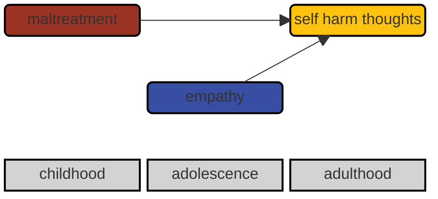
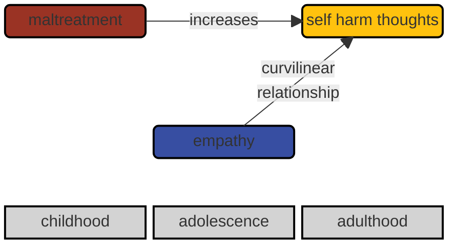
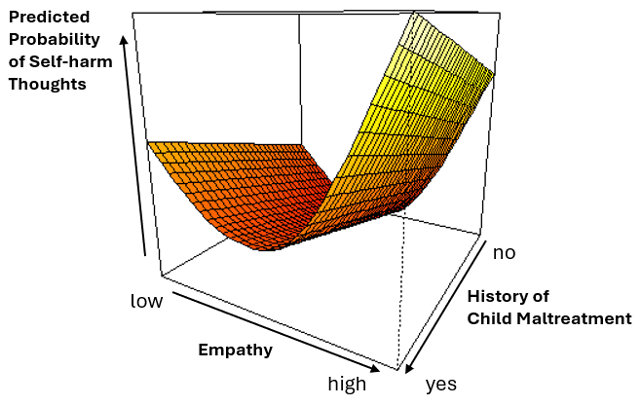

# When Empathy Helps and Hurts: 
## Non-Linear Associations Between Early Childhood Maltreatment History, Empathy and Self-Harm Thoughts

**Objective:** Child maltreatment is a well-established risk factor for self-harm, yet the affective processes underlying this association remain unclear. This study examines how empathy relates to the association between early childhood maltreatment and lifetime self-harm thoughts.

**Method:** Data from 303 adults were stratified based on the presence or absence of maltreatment history in early childhood. Self-reports of lifetime self-harm thoughts in adulthood and empathy during adolescence were examined in both groups using generalized additive models to assess non-linear relationships.

**Results:** Adults with early childhood maltreatment history were more likely to report self-harm thoughts than those without the history (χ² = 14.87, p < .01). A significant nonlinear association was observed between empathy and self-harm thoughts (edf = 2.14 χ² = 9.67, p = .02). 

Predicted probabilities of self-harm thoughts were lowest at moderate levels of empathy for both groups. Risk for self-harm thoughts was highest among individuals with early childhood maltreatment history and low or high empathy.

**Conclusion:** While a moderate level of empathy can be protective from early childhood maltreatment, both low and high levels of empathy were associated with a greater risk for self-harm thoughts. Findings suggest the need to further investigate the role of empathy as a “risky strength” among adults.

