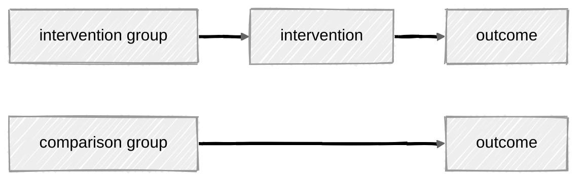
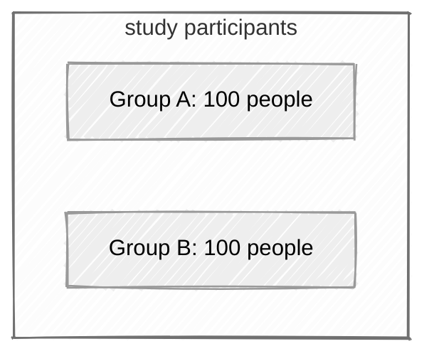
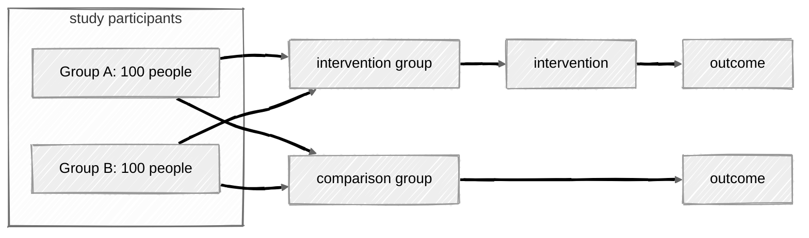

# Why Do We Need Multivariate Models To Evaluate Interventions?

Across the world, there is a great deal of suffering. Many people have mental health issues or substance use issues. People often suffer the after effects of discrimination, poverty, trauma, violence or conflict.

Understandably, many people and organizations try to develop *interventions* or *programs* for those who suffer from such difficulties. 

Yet evaluating such *programs* may be more difficult than it appears.

Let's consider a simple evaluation of a *program* designed to improve mental health.

In its simplest form, an evaluation might consist of having one group of people--an *intervention group*--participate in the or *program*, while another group--a comparison group--does not participate. We would then compare outcomes across the two groups.[^ethics]

[^ethics]: Valid questions could be raised about the *ethics* of such an approach, specifically denying participation in the *program* to one group of people. If a program is of unknown benefit, it is *ethical* to evaluate this program with a comparison group approach, because it is *not yet known* whether the program confers benefit on its participants, and whether the program represents a valid use of time, energy and financial resources. Indeed, an evaluation might uncover the fact that the program has no beneficial effects, or even that the program is harmful! Once a program has been established as beneficial, it would likely be *unethical* to conduct an evaluation where the program is withheld from some participants. 

One big question or concern in conducting an evaluation of this type is that our group of participants may be composed of different subgroups of individuals. These groups might be different in that they might repsresent individuals of different racial, ethnic or gender identities, might be people from different communities, or might have quite different sets of past experiences. 

