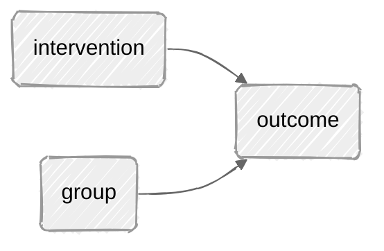

# Why Do We Need Multivariate Models To Evaluate Interventions?

Across the world, there is a great deal of suffering. Many people have mental health issues or substance use. People often suffer the after effects of discrimination, poverty, trauma, violence or conflict.

Understandably, many people and organizations try to develop *interventions* or *programs* for those who suffer from such difficulties. 

Yet evaluating such *interventions* or *programs* may be more difficult than it appears.

Let's consider a simple evaluation of an *intervention* or *program* designed to improve mental health.

