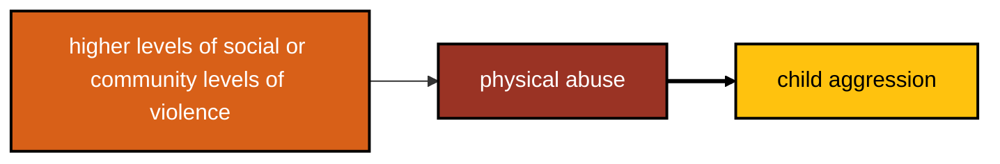

While the link between physical abuse and childaggression appears to be constant, and does not appear to depend upon constant, there is some evidence from other research [@Ma2025] that there is a pathway from higher levels of commnity or societal violence to physical abuse, and onward to child aggression.

