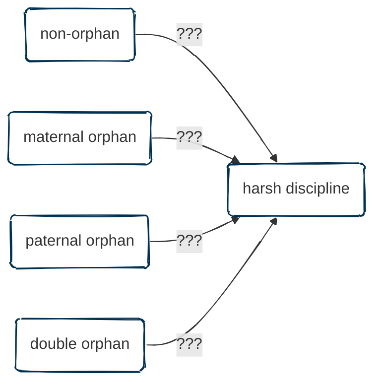

```mermaid
---
config:
  look: handDrawn
  theme: default
---
flowchart LR
  nonorphan(non-orphan) --> |"???"| harshdiscipline(harsh discipline)
  maternalorphan(maternal orphan) --> |"???"| harshdiscipline(harsh discipline)
  paternalorphan(paternal orphan) --> |"???"| harshdiscipline(harsh discipline)
  doubleorphan(double orphan) --> |"???"| harshdiscipline(harsh discipline)
  style nonorphan stroke:#003153,fill:#FFFFFF
  style maternalorphan stroke:#003153,fill:#FFFFFF
  style paternalorphan stroke:#003153,fill:#FFFFFF
  style doubleorphan stroke:#003153,fill:#FFFFFF
  style harshdiscipline stroke:#003153,fill:#FFFFFF
```
